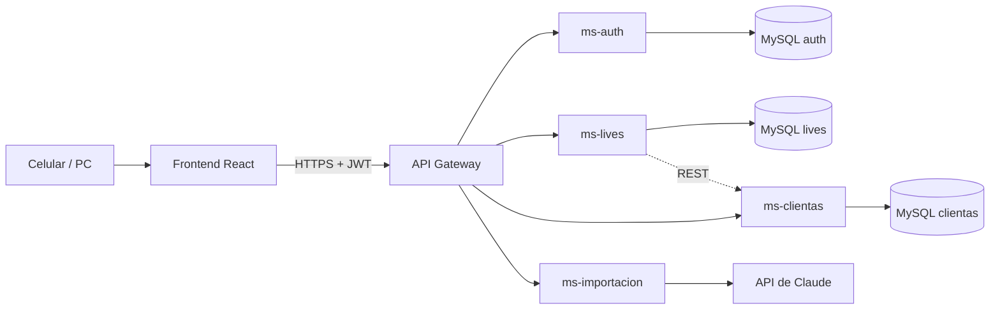

# ERS – LivesManage

## Ficha del documento

**DUOC UC – Escuela de Informática y Telecomunicaciones** Especificación de Requisitos de Software según estándar IEEE 830. Proyecto: LivesManage – registro de ventas en lives de TikTok (tienda de ropa) · Ramo: Desarrollo FullStack 2 · Revisión 2.0

| **Fecha** | **Revisión** | **Autor** | **Modificación** |
| --- | --- | --- | --- |
| 26/09/2026 | 1.0 | Maxi | Versión inicial: introducción, descripción general y requisitos (enfoque de inventario genérico). |
| 30/09/2026 | 2.0 | Maxi | Reenfoque en el live de TikTok: se eliminan productos, categorías, stock y ventas; se agregan sesiones de live, anotación rápida, cierre del live e importación de cuaderno. 15 RF y matriz de trazabilidad. |

## 1. Introducción

LivesManage es una aplicación web responsiva para una tienda de ropa que vende en local físico y por lives de TikTok. Reemplaza el cuaderno en el que hoy, durante cada live, una persona distinta a la que transmite anota a mano quién compra y cuánto, y apoya el cierre posterior del live y el seguimiento de las clientas.

### 1.1. Propósito

Este documento especifica los requisitos funcionales y no funcionales de LivesManage. Está dirigido al equipo de desarrollo, al docente del ramo Desarrollo FullStack 2 y a la tienda, y sirve como base para el diseño, la implementación, las pruebas y la aceptación del sistema.

### 1.2. Ámbito del sistema

El sistema se denominará **LivesManage**.

Se compone de un frontend en React, usado principalmente desde el celular, y un backend de microservicios Spring Boot detrás de un API Gateway, cada uno con su propia base de datos MySQL.

**Lo que el sistema hará:**

* Autenticar usuarios y controlar el acceso según rol (administrador y vendedor).
* Abrir y cerrar sesiones de live; toda anotación pertenece a una sesión.
* Anotar compras durante el live con la misma sintaxis del cuaderno (ej: "flo 6-4"), autocompletando la clienta o creándola, y sumando a su línea si ya tenía una.
* Quitar prendas canceladas con un toque y recalcular los totales.
* Registrar si cada clienta pagó, y mostrar siempre el total del live y el total pagado.
* Guiar el cierre del live: revisión de bolsas, cobro y forma de entrega (despacho, retiro o feria), con la dirección cuando corresponda.
* Mantener la ficha de cada clienta con su historial, total gastado, cancelaciones y no pagos, además de un ranking y la lista de clientas inactivas.
* Como función secundaria, importar un live desde una foto del cuaderno usando un modelo con visión, con revisión antes de guardar.

**Lo que el sistema no hará:**

* No se integrará con TikTok: no lee comentarios ni la transmisión; las compras las anota una persona.
* No registrará productos ni controlará stock: cada prenda es solo un precio, sin talla, descripción ni código.
* No procesará pagos ni emitirá boletas o facturas (SII); solo registra si la clienta pagó.
* No gestionará el despacho (couriers, seguimiento de envíos); solo registra la forma de entrega y la dirección.
* No registrará las ventas del local físico en esta versión.

**Beneficios y objetivos:** anotar más rápido y con menos errores que en el cuaderno, eliminar las sumas a mano, saber en todo momento cuánto se vendió y cuánto falta por cobrar, no perder cobros ni direcciones en el cierre, y conocer a las mejores clientas y a las que dejaron de comprar.

### 1.3. Definiciones, acrónimos y abreviaturas

| **Término** | **Definición** |
| --- | --- |
| ERS | Especificación de Requisitos de Software. |
| API REST | Interfaz HTTP que el frontend usa para solicitar operaciones al backend. |
| API Gateway | Punto de entrada único del backend: recibe las peticiones del frontend, valida el JWT y las enruta al microservicio correspondiente. |
| Microservicio | Servicio Spring Boot independiente, responsable de un dominio y con su propia base de datos MySQL. |
| SPA | Single Page Application: aplicación web que se renderiza dinámicamente en el navegador. |
| JWT | JSON Web Token: token firmado que identifica al usuario autenticado en cada petición. |
| Live | Transmisión en vivo por TikTok en la que la tienda muestra y vende prendas. |
| Sesión de live | Registro de un live en el sistema. Agrupa todas las anotaciones hechas en él y pasa por los estados Abierta, En cierre y Cerrada. |
| Línea | Equivalente a una línea del cuaderno: una clienta, sus prendas y su total dentro de una sesión. Una clienta tiene como máximo una línea por sesión. |
| Prenda | Cada ítem anotado en una línea. Solo tiene precio; no tiene talla, descripción ni código. Puede estar Vigente o Cancelada. |
| Sintaxis rápida | Formato de anotación del cuaderno: nombre seguido de precios en miles separados por guiones. Ej: "flo 6-4" son dos prendas de $6.000 y $4.000 para la clienta que coincide con "flo". |
| Estado de pago | Estado de una línea: Pendiente, Pagado o No pagó. Reemplaza el destacado rosado del cuaderno. |
| Bolsa | Bolsa física donde se juntan las prendas de cada clienta durante el live; en el cierre se revisa contra su línea. |
| Forma de entrega | Cómo recibe la clienta sus prendas: Despacho a domicilio, Retiro o Entrega en feria. |
| Entrega agrupada | Varias clientas de un mismo live que reciben juntas en una misma dirección (ej: hermanas). Cada una conserva su línea y su total. |
| Total del live | Suma de las prendas vigentes de todas las líneas de la sesión. El total pagado suma solo las líneas Pagadas. |
| Clienta inactiva | Clienta con al menos una compra y sin compras en los últimos N días (60 por defecto). |
| UAT | Pruebas de aceptación de usuario: la tienda valida el sistema en escenarios reales. |
| Matriz de trazabilidad | Tabla que relaciona cada RF con su criterio de aceptación y sus pruebas (sección 3.5). |

### 1.4. Referencias

* IEEE Std 830-1998, Recommended Practice for Software Requirements Specifications.
* Documentación oficial de React, Spring Boot, Spring Cloud Gateway y Playwright.
* Documentación de la API de Claude (Anthropic) para análisis de imágenes.
* Ley 19.628 sobre protección de la vida privada y Ley 21.719 que la reforma.
* Material del ramo Desarrollo FullStack 2, Duoc UC.

### 1.5. Visión general del documento

La sección 2 describe el contexto del producto: situación actual, funciones, usuarios, restricciones y supuestos. La sección 3 detalla los requisitos específicos: interfaces, requisitos funcionales por módulo, requisitos no funcionales y la matriz de trazabilidad hacia las pruebas. Al final se listan los puntos pendientes por confirmar.

## 2. Descripción general

### 2.1. Perspectiva del producto

LivesManage reemplaza un proceso manual en papel y no se integra con otro software de la tienda. La tabla resume cómo se trabaja hoy y qué requisito lo reemplaza.

| **Hoy en el cuaderno** | **Limitación** | **En LivesManage** |
| --- | --- | --- |
| Se escribe el nombre y los precios en miles ("Gabriela Peña 6-6-5 = 17.000"). | Con muchas compras seguidas cuesta seguir el ritmo del live. | Anotación rápida con la misma sintaxis y autocompletado de clientas (RF-05). |
| Si la clienta pide de nuevo, se agrega a su línea. | Hay que ubicar su línea en la página. | El sistema suma a su línea automáticamente (RF-05). |
| Si cancela, se tacha la prenda y se corrige el total. | Sumas y correcciones a mano, propensas a error. | Quitar la prenda con un toque y recálculo automático (RF-06). |
| Las clientas que pagaron se destacan en rosado. | No se ve de un vistazo cuánto falta por cobrar. | Estado de pago, total pagado y pendiente siempre visibles (RF-07, RF-08). |
| Al final se suma el total del live. | Suma manual al terminar. | Total del live calculado en todo momento (RF-08). |
| Cierre: revisar bolsas, sacar el total, cobrar y preguntar la forma de entrega. | Se hace a mano, sin registro del cobro ni de las direcciones. | Pantalla de cierre guiada (RF-09 a RF-11). |
| Solo se anota nombre y precio. | No se sabe quién compra más, quién cancela o quién no paga. | Ficha, ranking y clientas inactivas (RF-12 a RF-14). |

**Arquitectura:** cliente-servidor con frontend React (SPA) y backend de microservicios Spring Boot. El frontend solo se comunica con el API Gateway, que valida el JWT y enruta cada petición. Se proponen cuatro microservicios, cada uno con su propia base MySQL: autenticación y usuarios, lives (sesiones, líneas, prendas, pagos y entregas), clientas (fichas, direcciones y estadísticas) e importación (llamada al modelo con visión).

### 2.2. Funciones del producto

| **Módulo** | **Funciones principales** | **RF** |
| --- | --- | --- |
| Acceso y usuarios | Inicio y cierre de sesión, control por rol y gestión de usuarios. | RF-01 a RF-03 |
| Sesiones de live | Abrir un live y consultar los anteriores con sus totales. | RF-04 |
| Pantalla de live | Anotación rápida con la sintaxis del cuaderno, corrección de líneas, estado de pago y totales siempre visibles. | RF-05 a RF-08 |
| Cierre del live | Revisión de bolsas, cobro, forma de entrega y dirección, y cierre de la sesión. | RF-09 a RF-11 |
| Clientas | Ficha con historial, total gastado, cancelaciones y no pagos; ranking y clientas inactivas. | RF-12 a RF-14 |
| Importar cuaderno (secundaria) | Extraer las líneas de una foto del cuaderno con un modelo con visión, para revisarlas antes de guardar. | RF-15 |

### 2.3. Características de los usuarios

Lo usarán entre 2 y 3 personas: el desarrollador durante el proyecto y 1 o 2 personas de la tienda. Durante el live lo usa la persona que anota, que no es la que transmite; lo hace desde el celular y en paralelo al live, por lo que cada acción frecuente debe resolverse con un texto corto o un toque.

| **Rol** | **Descripción** | **Conocimientos requeridos** |
| --- | --- | --- |
| Administrador | Dueña o encargada. Todo lo del vendedor, más gestión de usuarios, desactivar clientas, reabrir lives cerrados y configurar el criterio de clienta inactiva. | Uso básico de celular o PC y navegador web. |
| Vendedor | Persona que anota durante el live y hace el cierre. Abre lives, anota y corrige compras, marca pagos, registra entregas y gestiona clientas. | Uso básico de celular; conoce la forma de anotar del cuaderno. |

### 2.4. Restricciones

* Frontend en React; backend en Java con Spring Boot en microservicios con API Gateway, cada microservicio con su propia base MySQL (exigencia del ramo).
* Comunicación mediante API REST con JSON sobre HTTP (HTTPS en producción) y autenticación con JWT.
* Diseño mobile-first: el uso principal es desde el celular durante el live.
* Pruebas exigidas por el ramo: unitarias (Vitest o Jasmine) y de aceptación automatizadas con Playwright, con evidencia de trazabilidad entre requisitos y pruebas.
* La llamada al modelo con visión (API de Claude) se hace solo desde el backend; la clave nunca llega al navegador.
* Plazo acotado al semestre académico.
* El sistema maneja datos personales de clientas, por lo que requiere autenticación obligatoria.

### 2.5. Suposiciones y dependencias

* La persona que anota cuenta con un celular o PC con internet durante el live.
* Una sola persona anota por live; si en el futuro anotan dos a la vez, se necesitará sincronización en tiempo real.
* Las prendas no se identifican: cada una es solo un precio. Si la tienda quiere registrar talla o descripción, habrá que revisar el modelo de datos.
* Los precios se anotan en miles enteros (6 = $6.000).
* Los pagos se reciben fuera del sistema (transferencia o efectivo); el sistema solo registra si se pagó.
* La foto del cuaderno debe ser legible; la extracción automática puede equivocarse y siempre requiere revisión humana.
* El despliegue (servidor, nube o entorno local para el ramo) queda sujeto a lo que definan el ramo y la tienda.

### 2.6. Requisitos futuros

* Alertas de clientas problemáticas (muchas cancelaciones o no pagos).
* Mensaje de cobro generado para copiar y enviar por WhatsApp o TikTok.
* Fusionar clientas duplicadas.
* Registro de ventas del local físico.
* Seguimiento del despacho (preparado, enviado, entregado) y costo de envío.
* Exportación del resumen del live a Excel o PDF.
* Anotación simultánea desde varios dispositivos, sincronizada en tiempo real.

## 3. Requisitos específicos

Cada requisito tiene un código único (RF-XX funcional, RNF-XX no funcional) y una prioridad: **Esencial** (sin él el sistema no cumple su objetivo), **Deseable** (aporta valor, se implementa si hay tiempo) u **Opcional**.

### 3.1. Requisitos comunes de las interfaces

#### 3.1.1. Interfaces de usuario

* Aplicación web SPA diseñada primero para celular en vertical (desde 360 px de ancho), usable también en tablet y PC.
* Pantallas principales: Inicio de sesión, Lives, Pantalla de live, Cierre del live, Clientas, Ficha de clienta, Ranking e inactivas, Importar cuaderno y Usuarios (solo administrador).
* Pantalla de live: totales fijos arriba, campo de anotación siempre visible y lista de líneas debajo. Las acciones frecuentes (quitar prenda, marcar pago) se hacen con un toque, con áreas táctiles de al menos 44 × 44 px.
* Menú visible según rol: el vendedor no ve la gestión de usuarios.
* Confirmación antes de acciones importantes (terminar live, finalizar cierre, desactivar) y mensajes de error claros.
* Montos en pesos chilenos (CLP), sin decimales, con separador de miles; fechas en formato dd/mm/aaaa.

#### 3.1.2. Interfaces de hardware

No requiere hardware especial: funciona en celular, tablet o PC con navegador. Para importar el cuaderno se puede usar la cámara del celular.

#### 3.1.3. Interfaces de software

| **Producto** | **Propósito** | **Interfaz** |
| --- | --- | --- |
| Navegador web (Chrome y Safari en celular; Chrome, Edge y Firefox en PC; versiones actuales) | Ejecutar el frontend React | HTML, CSS, JavaScript |
| API Gateway (Spring Cloud Gateway) | Punto de entrada único, enrutamiento y validación del JWT | API REST, JSON |
| Microservicios Spring Boot | Lógica de negocio por dominio | API REST, JSON |
| MySQL 8 (una base por microservicio) | Persistencia de datos | JDBC / JPA |
| API de Claude (Anthropic) | Extraer las líneas de una foto del cuaderno | HTTPS, JSON; solo desde el backend |

#### 3.1.4. Interfaces de comunicación

El frontend se comunica solo con el API Gateway por HTTP (HTTPS en producción) mediante peticiones REST con cuerpo JSON. Cada petición a un recurso protegido incluye el token JWT en la cabecera Authorization. Los microservicios se comunican entre sí por REST dentro de la red interna.

### 3.2. Requisitos funcionales

Son 15 requisitos en seis módulos. Actores: **Admin** (administrador) y **Vendedor**; "Ambos" indica que los dos roles pueden ejecutarlo. El criterio de aceptación de cada RF está en la matriz de trazabilidad (3.5).

#### 3.2.1. Acceso y usuarios

| **ID** | **Requisito** | **Actor** | **Descripción** | **Prioridad** |
| --- | --- | --- | --- | --- |
| RF-01 | Iniciar y cerrar sesión | Ambos | El usuario ingresa con correo y contraseña. Si los datos son incorrectos, se muestra un mensaje genérico sin indicar qué campo falló; un usuario desactivado no puede ingresar. Al cerrar sesión, el token se descarta del navegador. | Esencial |
| RF-02 | Controlar acceso por rol | Sistema | Pantallas y operaciones se restringen según el rol en el frontend y se validan en el API Gateway y en cada microservicio. | Esencial |
| RF-03 | Gestionar usuarios | Admin | Crear, editar y desactivar usuarios (nombre, correo único, rol y contraseña inicial). No se eliminan físicamente. | Esencial |

#### 3.2.2. Sesiones de live

Estados de una sesión: **Abierta** (se anotan compras), **En cierre** (el live terminó: se revisan bolsas, se cobra y se define la entrega) y **Cerrada** (solo lectura).

| **ID** | **Requisito** | **Actor** | **Descripción** | **Prioridad** |
| --- | --- | --- | --- | --- |
| RF-04 | Abrir y consultar lives | Ambos | Abrir crea una sesión Abierta con fecha y hora de inicio y un nombre opcional (ej: "Live jueves noche"). Solo puede haber una sesión Abierta; si ya existe, el sistema ofrece continuar en ella. La lista de lives muestra fecha, estado, número de clientas, total del live y total pagado, y permite abrir cada uno. | Esencial |

#### 3.2.3. Pantalla de live

| **ID** | **Requisito** | **Actor** | **Descripción** | **Prioridad** |
| --- | --- | --- | --- | --- |
| RF-05 | Anotar compra con sintaxis rápida | Ambos | Ver detalle abajo. | Esencial |
| RF-06 | Corregir línea | Ambos | Un toque sobre una prenda la marca Cancelada (se ve tachada, no se borra) y recalcula los totales; otro toque la restaura. También permite cambiar la clienta de la línea si se eligió mal; si la nueva clienta ya tenía línea en el live, ambas se unen. Disponible mientras la sesión no esté Cerrada. | Esencial |
| RF-07 | Marcar estado de pago | Ambos | Con un toque la línea pasa de Pendiente a Pagado, o vuelve a Pendiente. Las líneas pagadas se destacan con color, como el rosado del cuaderno. Se registra fecha, hora y usuario del cambio. | Esencial |
| RF-08 | Ver hoja y totales del live | Ambos | Muestra las líneas en el formato del cuaderno (ej: "Gabriela Peña 6-6-5 = $17.000"), con la última modificada arriba y búsqueda por nombre. El total del live, el total pagado, lo pendiente por cobrar y el número de clientas quedan siempre visibles y se actualizan tras cada anotación, corrección o pago, sin recargar la página. | Esencial |

**RF-05 · Anotar compra con sintaxis rápida**

1. Con una sesión Abierta, el usuario escribe en el campo de anotación el nombre de la clienta seguido de los precios en miles separados por guiones, igual que en el cuaderno (ej: "flo 6-4").
2. Mientras escribe el nombre, el sistema sugiere clientas que coinciden (sin distinguir mayúsculas ni tildes), mostrando primero las que ya tienen línea en este live y luego las de compra más reciente.
3. Al presionar Enter (o Agregar en el celular), la anotación se asigna a la sugerencia destacada. Si no hay coincidencias, o el usuario elige "Nueva clienta", el sistema crea una clienta con ese nombre.
4. Si la clienta ya tiene una línea en la sesión, las prendas se agregan a esa línea; si no, se crea una línea nueva en estado Pendiente.
5. El sistema convierte cada precio a pesos (6 → $6.000), recalcula el total de la línea y del live, limpia el campo y lo deja listo para la siguiente anotación.
6. Durante unos segundos muestra un aviso con el resultado (ej: "Florencia Ruiz: 6-4 = $10.000") y la opción Deshacer.

Validaciones y errores:

* Debe haber un nombre y al menos un precio; cada precio es un número entero entre 1 y 999.
* Se aceptan espacios alrededor de los guiones ("flo 6 - 4").
* Si el texto no cumple el formato, no se guarda nada, se indica el problema y el texto se conserva para corregirlo.
* No se puede anotar en una sesión que no esté Abierta.

#### 3.2.4. Cierre del live

| **ID** | **Requisito** | **Actor** | **Descripción** | **Prioridad** |
| --- | --- | --- | --- | --- |
| RF-09 | Terminar live y revisar bolsas | Ambos | Pasa la sesión de Abierta a En cierre (ya no se usa la anotación rápida) y muestra la pantalla de cierre con un check de bolsa revisada por clienta y el avance (ej: 12 de 18). Si una bolsa no cuadra con su línea, se corrige con RF-06. | Esencial |
| RF-10 | Registrar forma de entrega | Ambos | Por cada clienta se elige Despacho, Retiro o Feria. Si es Despacho, se confirma la dirección de su ficha o se ingresa una nueva, que queda guardada. Varias clientas del mismo live pueden agruparse en una entrega a una misma dirección (ej: hermanas); cada una conserva su línea y su total. | Esencial |
| RF-11 | Finalizar cierre | Ambos (reabrir: Admin) | Ver detalle abajo. | Esencial |

**Flujo de cierre (RF-09 a RF-11)**

1. Al terminar la transmisión, el usuario elige "Terminar live" y confirma; la sesión pasa a En cierre. Desde ese momento se puede abrir un live nuevo.
2. Revisa cada bolsa contra su línea y la marca como revisada; si no cuadra, corrige la línea (RF-06).
3. Cobra a cada clienta: la pantalla muestra el monto de cada una y, al recibir el pago, la línea se marca Pagada (RF-07). El total pagado y lo pendiente se ven siempre.
4. Registra la forma de entrega de cada clienta y la dirección si es despacho (RF-10).
5. Elige "Finalizar cierre". El sistema muestra un resumen: total del live, total pagado, total sin pagar y cantidad de despachos, retiros y entregas en feria.
6. Al confirmar, la sesión pasa a Cerrada y sus datos alimentan las estadísticas de las clientas.

Validaciones y errores:

* No se puede finalizar si hay bolsas sin revisar.
* Las líneas que siguen Pendientes se listan y deben marcarse como No pagó para poder finalizar; si se espera su pago, la sesión puede quedar En cierre los días que haga falta.
* Toda línea Pagada debe tener forma de entrega, y dirección si es despacho.
* Una sesión Cerrada es de solo lectura; solo el administrador puede reabrirla (vuelve a En cierre).

#### 3.2.5. Clientas

Las estadísticas de una clienta se calculan con sus líneas de lives Cerrados: una compra es una línea Pagada y el total gastado suma solo líneas Pagadas. Las cancelaciones cuentan las prendas que quedaron Canceladas al cerrar el live, y los no pagos, las líneas marcadas No pagó.

| **ID** | **Requisito** | **Actor** | **Descripción** | **Prioridad** |
| --- | --- | --- | --- | --- |
| RF-12 | Registrar y buscar clientas | Ambos (desactivar: Admin) | Datos: nombre (obligatorio), usuario de TikTok, teléfono y dirección de despacho. Solo el nombre es obligatorio porque la clienta suele crearse desde la anotación rápida; el resto se completa después. Avisa si el usuario de TikTok o el teléfono ya existen. Búsqueda por nombre, usuario de TikTok o teléfono. El administrador puede desactivarla (baja lógica; conserva su historial). | Esencial |
| RF-13 | Ver ficha de la clienta | Ambos | Datos de contacto, dirección e historial por live (fecha, prendas, total, estado de pago y forma de entrega). Indicadores: total gastado, número de compras, ticket promedio, última compra, prendas canceladas y lives sin pago. | Esencial |
| RF-14 | Ranking y clientas inactivas | Ambos (configurar días: Admin) | Ranking por total gastado o por número de compras en un rango de fechas. Lista de clientas inactivas con días sin comprar, usuario de TikTok y teléfono para contactarlas. El administrador configura los días de inactividad (60 por defecto). | Esencial |

#### 3.2.6. Importar cuaderno (función secundaria)

| **ID** | **Requisito** | **Actor** | **Descripción** | **Prioridad** |
| --- | --- | --- | --- | --- |
| RF-15 | Importar cuaderno desde foto | Ambos | Ver detalle abajo. No reemplaza la anotación en vivo; sirve para pasar al sistema lives anotados en papel. | Deseable |

**RF-15 · Importar cuaderno desde foto**

1. El usuario elige Importar cuaderno, selecciona la sesión de destino (una que no esté Cerrada, o una nueva) y sube una foto de la página (JPG o PNG) o la toma con la cámara.
2. El backend envía la imagen al modelo con visión (API de Claude) y recibe un JSON con las líneas detectadas: nombre, precios, total escrito, prendas tachadas y si la línea estaba destacada (pagada).
3. El sistema muestra las líneas en una tabla editable y marca las que requieren atención: total escrito distinto de la suma de precios, textos ilegibles y nombres que no coinciden con clientas existentes (se crearán como nuevas).
4. El usuario corrige lo necesario y confirma; recién entonces se guardan las líneas, con las mismas reglas de RF-05.

Validaciones y errores:

* Nada se guarda sin la confirmación del usuario.
* Si el modelo falla o no reconoce la imagen, se informa y se puede anotar a mano.
* La foto no se conserva después de procesarla.

### 3.3. Requisitos no funcionales

#### 3.3.1. Rendimiento

| **ID** | **Requisito** |
| --- | --- |
| RNF-01 | El sistema soporta al menos 5 usuarios conectados simultáneamente. |
| RNF-02 | Anotar una compra, quitar una prenda o marcar un pago se refleja en pantalla en menos de 1 segundo; el resto de las operaciones responde en menos de 2 segundos en el 95% de los casos. |
| RNF-03 | El ranking y la lista de clientas inactivas con hasta 12 meses de datos se generan en menos de 5 segundos. |
| RNF-04 | La extracción de una foto del cuaderno tarda menos de 60 segundos y muestra el progreso mientras se procesa. |

#### 3.3.2. Seguridad

| **ID** | **Requisito** |
| --- | --- |
| RNF-05 | Las contraseñas se almacenan cifradas con BCrypt; nunca en texto plano. |
| RNF-06 | Autenticación mediante JWT con expiración de 8 horas, suficiente para un live y su cierre. |
| RNF-07 | Todos los endpoints, salvo el de inicio de sesión, exigen token válido: el API Gateway valida el token y cada microservicio verifica el rol. |
| RNF-08 | Toda entrada del usuario se valida en frontend y backend para prevenir datos inválidos e inyección SQL. |
| RNF-09 | Cada anotación, corrección, cambio de pago y cierre registra el usuario y la fecha y hora (trazabilidad). |
| RNF-10 | La clave de la API de Claude se define por variable de entorno en el backend; nunca se incluye en el frontend ni en el repositorio. |

#### 3.3.3. Fiabilidad

| **ID** | **Requisito** |
| --- | --- |
| RNF-11 | Los totales se calculan siempre en el backend a partir de las prendas vigentes; nunca se guardan totales ingresados a mano. |
| RNF-12 | Una anotación se guarda completa o no se guarda (sin prendas sueltas ni totales descuadrados), y finalizar el cierre se ejecuta como una transacción. |
| RNF-13 | Si falla la conexión o expira la sesión durante el live, el texto escrito no se pierde y el sistema avisa que la anotación no se guardó. |
| RNF-14 | Ante un error, el sistema muestra un mensaje comprensible y registra el detalle técnico en los logs del microservicio. |

#### 3.3.4. Usabilidad

| **ID** | **Requisito** |
| --- | --- |
| RNF-15 | La pantalla de live se usa con una mano en un celular de 360 px de ancho, sin desplazamiento horizontal. |
| RNF-16 | Anotar una compra típica (nombre y hasta 4 precios) toma menos de 5 segundos a una persona entrenada. |
| RNF-17 | Una persona que hoy anota en el cuaderno puede anotar un live completo tras 10 minutos de explicación (se verifica en UAT). |

#### 3.3.5. Disponibilidad

| **ID** | **Requisito** |
| --- | --- |
| RNF-18 | Disponible al menos el 99% del tiempo durante los horarios de live, una vez desplegado. |
| RNF-19 | Respaldo automático diario de cada base de datos, conservando al menos los últimos 7 días. |

#### 3.3.6. Mantenibilidad

| **ID** | **Requisito** |
| --- | --- |
| RNF-20 | Cada microservicio se organiza en capas (controller, service, repository) con DTOs; el frontend, en componentes reutilizables. |
| RNF-21 | Código versionado en GitHub en un monorepo con frontend/ y backend/, con README de instalación y ejecución. |
| RNF-22 | Pruebas unitarias en frontend (Vitest o Jasmine) y backend (JUnit), con cobertura mínima del 60% en la lógica de negocio: interpretación de la sintaxis, cálculo de totales y reglas de cierre. |
| RNF-23 | Pruebas de aceptación automatizadas con Playwright para cada RF esencial, ejecutadas en un viewport de celular. |
| RNF-24 | Endpoints de la API documentados con Swagger / OpenAPI. |

#### 3.3.7. Portabilidad

| **ID** | **Requisito** |
| --- | --- |
| RNF-25 | El frontend funciona en las últimas dos versiones de Chrome y Safari en celular, y de Chrome, Edge y Firefox en PC. |
| RNF-26 | La configuración de bases de datos y secretos se define por variables de entorno, sin valores fijos en el código. |
| RNF-27 | El backend puede ejecutarse en Windows, Linux o macOS con Java 17 o superior. |

### 3.4. Otros requisitos

* Interfaz y mensajes en español de Chile.
* Montos en CLP como números enteros; fechas y horas en zona horaria America/Santiago.
* El sistema almacena datos personales de clientas (nombre, usuario de TikTok, teléfono y dirección), por lo que debe cumplir la Ley 19.628 y considerar la Ley 21.719, que la reforma y entra en vigencia el 1 de diciembre de 2026: usarlos solo para la gestión comercial de la tienda, restringir su acceso a usuarios autenticados y permitir anonimizar a una clienta que lo solicite sin alterar los totales de los lives.
* Las fotos del cuaderno contienen nombres de clientas y se envían a un proveedor externo (Anthropic) solo para extraer los datos; la tienda debe estar informada de ello.

### 3.5. Matriz de trazabilidad (borrador)

Cada RF tiene un criterio de aceptación verificable. El criterio se automatiza como prueba Playwright en viewport de celular (E2E-XX) y se valida con la tienda en un escenario de aceptación de usuario (UAT-XX). La matriz se completa con el resultado de cada prueba en cada entrega.

| **RF** | **Criterio de aceptación** | **Pruebas unitarias** | **Playwright** | **UAT** |
| --- | --- | --- | --- | --- |
| RF-01 | Con credenciales válidas entra; con inválidas ve un mensaje genérico; un usuario desactivado no entra. | AuthService (JUnit); formulario de login (Vitest) | E2E-01 | UAT-01 |
| RF-02 | El vendedor no ve Usuarios y la API le responde 403 si intenta usarla. | Filtro de roles (JUnit); rutas protegidas (Vitest) | E2E-02 | UAT-01 |
| RF-03 | El admin crea un vendedor que luego inicia sesión; un correo repetido se rechaza. | UsuarioService (JUnit) | E2E-03 | UAT-01 |
| RF-04 | Con un live Abierto no se puede abrir otro; la lista muestra los totales de cada live. | SesionService (JUnit) | E2E-04 | UAT-02 |
| RF-05 | "flo 6-4" suma $10.000 a la línea existente de Florencia; "ana 5" crea clienta y línea; "flo 6-" muestra error y conserva el texto. | Intérprete de sintaxis (Vitest); LineaService (JUnit) | E2E-05 | UAT-02 |
| RF-06 | Quitar una prenda de $6.000 baja la línea y el total del live en $6.000; restaurarla los repone. | Cálculo de totales (JUnit) | E2E-06 | UAT-02 |
| RF-07 | Marcar Pagada una línea de $17.000 la destaca y sube el total pagado en $17.000. | LineaService (JUnit) | E2E-07 | UAT-02 |
| RF-08 | Tras cada acción, el total del live es igual a la suma de las líneas visibles. | Componente de totales (Vitest) | E2E-08 | UAT-02 |
| RF-09 | Al terminar el live desaparece el campo de anotación y el avance cuenta las bolsas revisadas. | SesionService (JUnit) | E2E-09 | UAT-03 |
| RF-10 | Despacho exige dirección; una dirección nueva queda en la ficha; dos clientas agrupadas comparten dirección. | EntregaService (JUnit) | E2E-10 | UAT-03 |
| RF-11 | No se puede finalizar con bolsas sin revisar o líneas Pendientes; al finalizar, el live queda de solo lectura. | Reglas de cierre (JUnit) | E2E-11 | UAT-03 |
| RF-12 | Crear una clienta con un usuario de TikTok ya registrado muestra aviso de duplicado. | ClientaService (JUnit) | E2E-12 | UAT-04 |
| RF-13 | El total gastado de la ficha es igual a la suma de sus líneas Pagadas en lives cerrados. | Cálculo de estadísticas (JUnit) | E2E-13 | UAT-04 |
| RF-14 | Una clienta sin compras hace 61 días aparece como inactiva; el ranking ordena por total gastado. | Consultas de ranking e inactividad (JUnit) | E2E-14 | UAT-04 |
| RF-15 | Con una foto de prueba se muestran las líneas extraídas para editar y nada se guarda hasta confirmar. | Validación del JSON extraído (JUnit) | E2E-15 (modelo simulado) | UAT-05 |

**Escenarios UAT** (con la tienda, idealmente con la persona que hoy anota):

* **UAT-01 Acceso:** la administradora crea el usuario de la persona que anota y esta inicia sesión en su celular.
* **UAT-02 Live simulado:** la persona que anota registra en el sistema las compras de un live anterior (desde la grabación o el cuaderno). Se acepta si los totales coinciden con el cuaderno y anotar no le toma más tiempo que escribir a mano.
* **UAT-03 Cierre:** se revisan las bolsas, se cobra y se registra la entrega de ese live hasta cerrarlo.
* **UAT-04 Clientas:** la tienda revisa fichas, ranking e inactivas y confirma que reflejan lo que conoce de sus clientas.
* **UAT-05 Importar:** se importa una página real del cuaderno y se corrige antes de guardar.

## Pendientes por confirmar

* ☐ ¿Hay precios que no sean miles exactos (ej: $3.500)? Si existen, la sintaxis debería aceptar un decimal (3,5).
* ☐ ¿El despacho tiene costo para la clienta? Si es así, ¿se suma a su total?
* ☐ ¿Hay pagos parciales o abonos? Hoy una línea está Pendiente o Pagada completa.
* ☐ Si una clienta ya pagó y luego se cancela una de sus prendas, ¿se le devuelve el dinero o queda a favor? Hoy la línea sigue Pagada (D-20).
* ☐ ¿La entrega en feria necesita registrar qué feria y qué día?
* ☐ ¿Anota una sola persona por live? El sistema asume que sí.
* ☐ ¿Se necesita registrar las ventas del local físico? Hoy quedan fuera de alcance.
* ☐ ¿60 días sin comprar es un buen criterio de clienta inactiva? (RF-14)
* ☐ Dónde se desplegará el sistema (servidor, nube o solo entorno local para el ramo).
